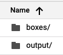

# spark-brightness-norm
A spark job to brightness normalize a set of images and flatten them into vectors using GCP's dataproc.

# Setup
* Put images into a bucket on GCP
* Create a dataproc cluster

# Usage
```
gcloud dataproc jobs submit pyspark --cluster $cluster brightness.py -- $input_dir $output_dir $target_mean
```

# Example Setup and Usage
* First, I set up my bucket like this:


* All the images are inside the boxes folder:


* The bucket is called `bucket`

* The cluster is called `cluster`

To execute the normalization and bring the images to a mean value of 128:
```
gcloud dataproc jobs submit pyspark --cluster cluster brightness.py -- gs://bucket/boxes gs://bucket/output 128
```



The output is in `part-xxxx` files in the output directory (can be just one file, it depends on the size), each line is a normalized image as a vector.